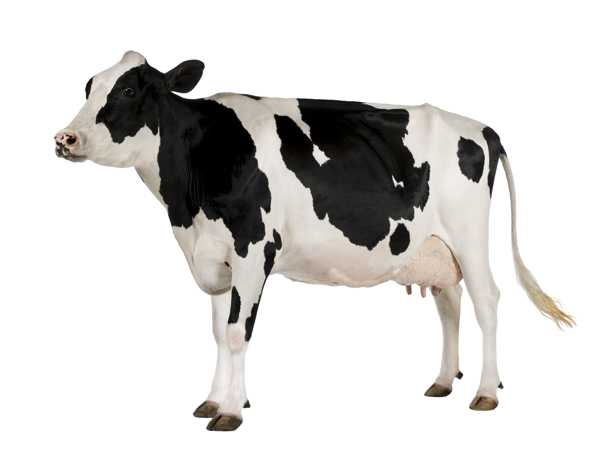
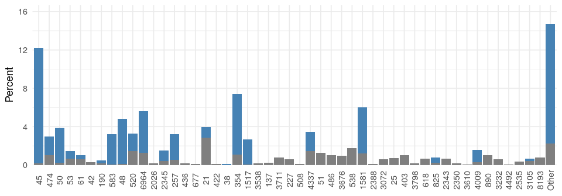

```{r setup, include=FALSE}
library(tidyverse)
library(lubridate)
library(meshblocknz)
library(knitr)
library(mgcv)
library(sf)
library(shiny)
library(gtools)
library(Manu)
library(colorspace)
theme_set(theme_minimal(base_size=13))
knitr::opts_chunk$set(echo = FALSE, message = FALSE, warning = FALSE,
                      fig.retina = 3, fig.align='center',
                      fig.dim=c(4.8,4.8), out.width='100%', dev.args=list(bg="transparent"))

#theme_update(theme(plot.background = element_rect(fill = "transparent", color = NA)))
opts_chunk$set(echo=FALSE, message=FALSE, warning=FALSE, fig.height = 5, fig.align='center', bg='transparent', dev.args=list(bg='transparent'))
attr_data <- read.csv("data/dirichlet_island/attribution_data.csv") %>%
  filter(Source != "Human" | Year >= 2008)
sts = attr_data %>%
  group_by(ST) %>% count(Source) %>% spread(Source, n, fill=0) %>%
  ungroup()
sts_ur = attr_data %>% filter(Source == "Human") %>%
  group_by(ST) %>% count(UR2006) %>% ungroup()
nz = read_csv("data/dirichlet_island/dhb_cases.csv") %>%
  mutate(Date = dmy(paste(1, Month, Year))) %>%
  filter(Year >= 2006) %>% group_by(Date) %>%
  summarise(Count = sum(Count, na.rm=TRUE), Population = sum(PopulationInterpolated, na.rm=TRUE)) %>%
  mutate(Rate = Count/Population*100000*12)

attribution = read.csv("data/dirichlet_island/attribution.csv")
alpha = function(col, alpha) { rgb(t(col2rgb(col)/255), alpha=alpha) }
par(mar=c(3,3,2,1), mgp=c(2,.7,0), tck=-.03)
ax_col = "grey20"
fig_width = 10

source_cols <- c(Poultry="brown", Ruminants="steelblue2", Other="plum4", Water="green4")


# Gene stuff from NZSA talk here
max_genes <- read_csv("data/max_genes_by_distance.csv") |>
  mutate(dist_to_nearest = as_factor(dist_to_nearest) |> fct_rev()) |>
  mutate(sum = humans+genes, prod=humans*genes) |> 
  group_by(dist_to_nearest) |>
  mutate(max_sum = sum == max(sum), max_prod = prod == max(prod),
         max_equal = humans == genes) |>
  ungroup()

plot_right <- ggplot(max_genes) +
  geom_line(aes(x=humans, y=genes, col=dist_to_nearest, size=dist_to_nearest == 0)) +
  scale_colour_manual(values=c(scales::alpha(get_pal('Hoiho')[-3], 0.7), 'black')) +
  scale_size_manual(values=c(0.5, 1)) +
  guides(size='none', col=guide_legend(nrow=1)) +
  labs(x="Number of humans",
       y="Number of genes",
       col="SNPs") +
  theme(legend.position='bottom')

plot_dark <- plot_right +
  theme(rect = element_rect(fill='transparent'),
        #panel.background = element_rect(fill='transparent'),
        panel.grid = element_line(colour='grey30'),
        text = element_text(colour='white'),
        axis.text = element_text(colour='white')) +
  scale_colour_manual(values=c(get_pal('Hoiho')[-3], 'white')) +
  scale_size_manual(values=c(0.8, 1))
```

class: middle, inverse

# Source attribution

---

## New Zealand campylobacteriosis cases

```{r nz_cases, fig.dim=c(10, 5)}
ggplot(nz, aes(x=Date, y=Rate)) + geom_line(col='grey50') +
  geom_smooth(span=0.5, col="steelblue", fill="steelblue", alpha=0.3) +
  scale_y_continuous("Cases per 100,000 people per year", expand = c(0,0), lim=c(0,600)) +
  scale_x_date(expand = c(0,0)) +
  theme(axis.title.x = element_blank())
```

---

## Manawatu sentinel surveillance site

```{r manawatu_map, fig.dim=c(10, 5)}
manawatu = read_sf("maps/midcentral.shp")

nzmg.proj = '+proj=nzmg +lat_0=-41.0 +lon_0=173.0 +x_0=2510000.0 +y_0=6023150.0 +ellps=intl +units=m +towgs84=59.47,-5.04,187.44,0.47,-0.1,1.024,-4.5993 '

nz.map = read_sf("maps/NZ_region-NZTM2000.shp", layer="NZ_region-NZTM2000") |>
  st_make_valid()
manawatu <- manawatu %>% st_set_crs(nzmg.proj)

st_crs(manawatu) <- nzmg.proj
ggplot() + geom_sf(data = nz.map, fill = "grey80", col=NA, stroke=0) +
  geom_sf(data = manawatu, fill="steelblue", col = NA, stroke = 0) +
  theme_void()
```

---

## Where are people getting it from?

<div align="center">
<span class='inline'>
  
  
  
</span>
</div>

---

## MLST distribution of human cases

```{r, mlst dist human, fig.dim=c(10, 5)}
# top 20 or so isolates
top20 <- sts %>% mutate(ST = fct_lump(factor(ST), n=20, w=Human)) %>% gather(Source, Count, -ST) %>%
  group_by(ST, Source) %>% summarise(Count = sum(Count)) %>% group_by(Source) %>% mutate(Count = Count/sum(Count)) %>% ungroup() %>%
  spread(Source, Count) %>% mutate(ST = fct_reorder(ST, Human, .fun = identity, .desc=TRUE),
                                   ST = fct_relevel(ST, "Other", after = 23)) %>%
  gather(Source, Count, -ST, -Human) %>%
  mutate(Source = fct_relevel(Source, "Other", after=2)) %>%
  mutate(Colour = ST == "Other")

top_humans <- top20 %>% select(Human, ST, Colour) %>% unique()
ggplot(top_humans, aes(x=ST, y=Human, fill=Colour)) + 
  geom_col() +
  scale_fill_manual(values=c("steelblue", "grey60")) +
  scale_y_continuous("Percent human cases", labels = scales::percent, expand=c(0,0)) + 
  coord_cartesian(ylim = c(0,0.25)) +
  guides(fill='none') +
  theme(axis.title.x = element_blank(),
        axis.text.x = element_text(angle = 90, vjust=0.5))
```

---

## MLSTs are source specific

```{r source_specific_mlst, fig.dim=c(10, 5)}
ggplot(top20, aes(x=ST, y=Count, fill=Colour)) + geom_col(data=top_humans, aes(y=Human), alpha=0.3) + geom_col(aes(y=Count)) +
  scale_fill_manual(values=c("steelblue", "grey60")) +
  scale_y_continuous("Percent isolates", labels = scales::percent, expand=c(0,0)) +
  coord_cartesian(ylim = c(0,0.25)) +
  facet_wrap(~Source) +
  guides(fill='none') +
  theme(axis.title.x = element_blank(),
        axis.text.x = element_text(angle = 90, vjust=0.5))
```

---

## Assume human types are a mix of source types

<iframe src="https://shiny.massey.ac.nz/jcmarsha/OHA2019/" style="border: none;"></iframe>

---

## Adding statistics

.big-math[
$$P(\mathsf{Human~cases}) = \prod_h P(\mathsf{st}_h)$$
]

---

## Adding statistics

.big-math[
$$P(\mathsf{st}_h) = \sum_j P(\mathsf{st}_h~\mathsf{from~source}_j) P(\mathsf{source}_j)$$
]

---

## Adding statistics

.big-math[
$$P(\mathsf{st}_h) = \sum_j \underbrace{P(\mathsf{st}_h~\mathsf{from~source}_j)}_\text{genomic model} P(\mathsf{source}_j)$$
]

---

## Adding statistics

.big-math[
$$P(\mathsf{st}) = \sum_j \underbrace{P(\mathsf{st}_h~\mathsf{from~source}_j)}_\text{genomic model} \underbrace{P(\mathsf{source}_j)}_\text{attribution to source}$$
]

---

class: inverse, middle

# Genomic models

---

## Asymmetric Island model | D. Wilson (2009)

Assume that genotypes arise from two or more homogeneous mixing populations
where we have

- **Mutation**, where novel alleles are produced.

- **Recombination**, where the allele at a given locus has been observed before, but
not in this allelic profile (i.e. the alleles come from at least two different genotypes).

- **Migration** between sources of genotypes and alleles.

---

## Asymmetric Island model

We model $P(\mathsf{st}_h~\mathsf{from~source}_j)$ via:

$$P(\mathsf{st}_h \mid j,X) = \sum_{c\in X} \frac{M_{S_cj}}{N_{S_c}} \prod_{l=1}^7 \left\{\begin{array}{ll}\mu_j & \mbox{if }\mathsf{st}_h^{l}\mbox{ is novel,}\\(1-\mu_j)R_j\sum_{k=1}^J M_{kj}f^l_{\mathsf{st}_h^lk} & \mbox{if }\mathsf{st}_h^{l}\neq c^l,\\(1-\mu_j)\left[1 - R_j(1 - \sum_{k=1}^J M_{kj}f^l_{\mathsf{st}_h^lk})\right] & \mbox{if }\mathsf{st}_h^{l}=c^l\end{array}\right.$$

- $c \in X$ are candidate sequences from which $\mathsf{st}_h$ evolved (all sequences other than $\mathsf{st}_h$).
- $S_c$ is the source where candidate sequence $c$ was observed.
- $N_{S_c}$ is the number of types observed on source $S_c$.
- $\mu_j$ be the probability of a novel mutant allele from source $j$.
- $R_j$ be the probability that a type has undergone recombination in source $j$.
- $M_{kj}$ be the probability of an allele migrating from source $k$ to $j$.
- $f^l_{ak}$ be the frequency with which allele $a$ has been observed at locus $l$ in those genotypes sampled from source $k$.

---

## Asymmetric Island model

Use the source isolates to estimate the unknown parameters:

- The mutation probabilities $\mu_j$
- Recombination probabilities $R_j$
- Migration probabilities $M_{jk}$.

using a leave one out pseudo-likelihood MCMC algorithm.

Once we have these estimated, we can use all source sequences as candidates and estimate $P(\mathsf{st}_h~\mathsf{from~source}_j)$ for the observed human sequences (even those unobserved on the sources).

---

## Dirichlet model

Before we collect data, assume each type is equally likely for each source.

```{r, fig.dim=c(10, 3.5)}
set.seed(5)
top50 <- sts %>% mutate(ST = fct_lump(factor(ST), n=49, w=Human)) %>%
  gather(Source, Count, -ST) %>% 
  group_by(ST, Source) %>% summarise(Count = sum(Count)) %>%
  ungroup() %>% spread(Source, Count) %>%
  mutate(ST = fct_reorder(ST, Human, .fun = identity, .desc=TRUE),
                          ST = fct_relevel(ST, "Other", after = 50)) %>%
  select(ST, Poultry) %>% uncount(Poultry) %>%
  sample_n(100) %>% count(ST, name = "Poultry", .drop=FALSE) %>%
  mutate(Prior = 1) %>%
  gather(Source, Count, -ST) %>% mutate(Proportion = Count/sum(Count))
scale_fact <- 1/sum(top50$Count)

ggplot(top50 %>% filter(Source == "Prior"), aes(x=ST, y=Count)) + geom_col(fill="grey50") +
  scale_y_continuous("Count", expand=c(0,0)) +
  coord_cartesian(ylim = c(0,25)) +
  theme(axis.title.x = element_blank(),
        axis.text.x = element_text(angle = 90, vjust=0.5))
```

---

## Dirichlet model

Then add the observed counts.

```{r, fig.dim=c(10, 3.5)}
ggplot(top50, aes(x=ST, y=Count, fill=Source)) + geom_col() +
  scale_y_continuous("Count", expand=c(0,0)) +
  scale_fill_manual(values=c(Poultry = "steelblue", Prior = "grey40")) +
  guides(fill='none') +
  coord_cartesian(ylim = c(0,25)) +
  theme(axis.title.x = element_blank(),
        axis.text.x = element_text(angle = 90, vjust=0.5))
```

---

## Dirichlet model

And convert to proportions.

```{r, fig.dim=c(10, 3.5)}  
ggplot(top50, aes(x=ST, y=Proportion, fill=Source)) + geom_col() +
  scale_y_continuous("Percent", labels = scales::percent_format(accuracy=1, suffix=""), expand=c(0,0)) +
  scale_fill_manual(values=c(Poultry = "steelblue", Prior = "grey50")) +
  guides(fill='none') +
  coord_cartesian(ylim = c(0,25*scale_fact)) +
  theme(axis.title.x = element_blank(),
        axis.text.x = element_text(angle = 90, vjust=0.5))
```

---

## Dirichlet model

Get uncertainty directly.

<div class='center-fig'>
  
</div>

---

## Dirichlet model | S.J. Liao 2019

The prior and data model are:

$$
\begin{aligned}
\mathbf{\pi}_j &\sim \mathsf{Dirichlet}(\mathbf{\alpha}_j)\\
\mathbf{X}_{j} &\sim \mathsf{Multinomial}(n_j, \mathbf{\pi}_j)
\end{aligned}
$$

so that the posterior is
$$
\mathbf{\pi}_{j} \sim \mathsf{Dirichlet}(\mathbf{X}_j + \mathbf{\alpha}_j)
$$

where $\pi_j$ is the genotype distribution, $\mathbf{X}_j$ are the counts, and $\mathbf{\alpha}_j$ is the prior for source $j$.

---

## Genotype distributions

```{r, fig.dim=c(10, 5)}
genotype_fit <- read_csv("data/dirichlet_island/genotypes.csv") %>%
  mutate(Source = factor(Source, levels = c("Poultry", "Ruminants", "Other", "Water")))

common_sts <- c(474, 45, 50, 53, 48, 61, 190, 42) #, 354, 520)
plot_common <- genotype_fit %>% filter(ST %in% common_sts) %>%
  mutate(ST = factor(ST, levels=common_sts, labels = paste0("ST-", common_sts)),
         Source = fct_recode(Source, Rum = "Ruminants"))

ggplot(plot_common) + geom_linerange(aes(x=Source, ymin = lci, ymax=uci, group=Model), position=position_dodge(0.5)) + 
  geom_linerange(aes(x=Source, ymin = lcl, ymax = ucl, col=Model), size=2, position=position_dodge(0.5)) +
  geom_point(aes(x=Source, y=m, fill=Model), position=position_dodge(0.5), shape=21, size=2) +
  facet_wrap(~ST, nrow=2) +
  xlab("") +
  scale_y_continuous(name = "P(Source | ST)", limits=c(0,1), expand = c(0,0)) +
  scale_fill_manual(values = c("steelblue2", "brown")) +
  scale_colour_manual(values = c("steelblue2", "brown")) +
  theme(legend.position = c(0.93,0.89),
        legend.title = element_blank())
```

---

## Genotype distributions

```{r, fig.dim=c(7, 5), out.width='70%'}
sts <- c(403, 2343, 2026, 474)
plot_weird <- genotype_fit %>% filter(ST %in% sts) %>%
  mutate(ST = factor(ST, levels=sts, labels = paste0("ST-", sts)))

ggplot(plot_weird) + geom_linerange(aes(x=Source, ymin = lci, ymax=uci, group=Model), position=position_dodge(0.5)) + 
  geom_linerange(aes(x=Source, ymin = lcl, ymax = ucl, col=Model), size=2, position=position_dodge(0.5)) +
  geom_point(aes(x=Source, y=m, fill=Model), position=position_dodge(0.5), shape=21, size=2) +
  facet_wrap(~ST, nrow=2) +
  xlab("") +
  scale_y_continuous(name = "P(Source | ST)", limits=c(0,1), expand = c(0,0)) +
  scale_fill_manual(values = c("steelblue2", "brown")) +
  scale_colour_manual(values = c("steelblue2", "brown")) +
  theme(legend.position = c(0.90,0.89),
        legend.title = element_blank())
```

---

## Attribution results

```{r, fig.dim=c(7, 5), out.width='70%'}
overall <- read_csv("data/dirichlet_island/overall_attribution.csv") %>%
  mutate(Source = fct_relevel(Source, "Other", after=2))

ggplot(overall) + 
  geom_boxplot(aes(x=Source, lower = lcl, upper=ucl, ymin=lci, ymax=uci, middle=m, fill=Source), stat="identity", alpha=0.7, width=0.6) +
  scale_y_continuous(name="Attributed cases", labels=scales::percent_format(), limits=c(0,1), expand=c(0,0)) +
  scale_fill_manual(values = source_cols) +
  facet_wrap(~Model) +
  guides(fill='none', col='none') +
  theme(axis.title.x = element_blank(),
        legend.position = c(0.90,0.89),
        legend.title = element_blank())
```

---

class: middle, inverse

# What if we have more genes?

---

## What if we have more genes?

- With higher genomic precision, the counts used for the Dirichlet model will eventually drop to 1 of each as each isolate is likely unique.

- Worse than that, the human isolates will differ from all source isolates, so the source counts for them will be 0, so we lose all ability to discriminate.

- In theory the Island model should still work.

- But it... **doesn't :(**

---

## Island model attribution with more genes

```{r, fig.dim=c(7, 5), out.width='70%'}
many_genes <- read_csv("data/dirichlet_island/many_genes.csv")
ggplot(many_genes %>% filter(Model == "PerSource"), aes(x=Genes, y=fits, fill=Source, col=Source)) +
  geom_ribbon(aes(ymin=fits-0.03, ymax = fits+0.03), alpha=0.4, col='transparent') +
  geom_line(lwd=1) +
  scale_y_continuous("Attribution of human cases", labels = scales::percent, expand=c(0,0), limits = c(-1,1)) +
  coord_cartesian(ylim = c(0,1)) +
  scale_x_continuous(limits = c(5,100), expand=c(0,0)) +
  guides(col = 'none', fill='none')
```

---

## Why does this happen?

The island likelihood for each type is complicated, but if we have $g$ genes is approximately
$$
p(\mathsf{st} \mid m) \approx m^d (1-m)^{g-d}
$$
where $m$ is a combination of mutation and recombination probabilities, and $d$ is the average number of loci that differ between isolate pairs.

This is maximised when $m = d/g$ so that
$$
p(\mathsf{st} \mid m) \approx  f(m)^g
$$
where
$$
f(m) = m^m (1-m)^{1-m}
$$

---

## Why does this happen?

Suppose we have two sources with $m_1=0.02$ and $m_2=0.03$.

```{r, fig.dim=c(7, 5), out.width='70%'}
f <- function(m) { m^m *(1-m)^(1-m) }
fm <- expand.grid(m = c(0.02, 0.03), g = 1:100) %>% mutate(f = f(m)^g)
df <- fm %>% group_by(g) %>% summarise(df=exp(-diff(log(f))))
expr <- expression(paste("p( st |" ~ m[1] ~ ") / (p( st |"~m[2]~")"))
ggplot(df, aes(x=g, y=df)) + geom_line(lwd=2) +
  scale_y_continuous(expr, expand=c(0,0), lim=c(0,40)) + scale_x_continuous("Number of genes", expand=c(0,0))
```

The island model just ends up assigning everything to the lower diversity source.

---

## Can we avoid it?

- Instead of per-source estimates of recombination and mutation probabilities, make them common across all sources.

- This then stabilises the genotype probability distributions to be the same order of magnitude across all sources.

- We thus get sensible attribution with increasing gene counts

---

## Stable attribution as gene count increases

```{r, fig.dim=c(7, 5), out.width='70%'}
ggplot(many_genes %>% filter(Model == "Common"), aes(x=Genes, y=fits, fill=Source, col=Source)) +
  geom_ribbon(aes(ymin=fits-0.03, ymax = fits+0.03), alpha=0.4, col='transparent') +
  geom_line(lwd=1) +
  scale_y_continuous("Attribution of human cases", labels = scales::percent, expand=c(0,0), limits = c(-1,1)) +
  coord_cartesian(ylim = c(0,1)) +
  scale_x_continuous(limits = c(5,100), expand=c(0,0)) +
  guides(col = 'none', fill='none')
```

---

## Summary

- As we increase the number of genes, the Dirichlet model loses all ability to differentiate between sources.

- The Island model still works as it should, but we need to estimate shared mutation and recombination probabilities.

- We get a stable attribution as the number of genes increases.

- **But how should we choose genes?**

---

## Data

---

## Data problems

- High dimensional. $p=1343$ genes, $n=600$ source and $n=800$ human isolates.

- Many genes are highly diverse. Range from 3-164 different alleles, median 48.

- Many alleles are seen in only one isolate.

- Many alleles are seen in only one **human** isolate.

---

## What Helen's plan is

---

## What Helen showed

- Need a way to deal with categorical predictors with a large number of factors.

    - There are scoring methods to convert factors to numeric scores.
    - Could convert the factor to binary via indicators.

- Need a way to deal with 'absent' levels: those alleles in humans that aren't in the sources.

    - How should they be scored in the scoring methods?
    - Can we use auxiliary information (genetic distance between alleles) for the absent levels?

- Paper: Lost in the Forest <link>

    - Demonstrates existing scoring methods are biased, and presents a solution.
    - Shows how to use auxiliary information for the absent levels.

---

## Dealing with absent levels

- Treat the absent levels in humans as missing.

- With a tree or forest, we might be OK.

    - Could use 'surrogate splits' for a tree.
    - Some of the trees in the forest may not use the absent level(s).

- What if we try and remove the missingness?

- How many humans and/or genes would be retained?

---

.left-code[
## The chart

- Suppose we want to remove all the absent levels.

- And we want to retain $h$ human samples.

- What is the maximum number of genes $g(h)$ that we can
retain?

]

.right-plot[
```{r}
plot_right
```
]

---

.left-code[
## The chart

- Suppose we want to remove all the absent levels.

- And we want to retain $h$ human samples.

- What is the maximum number of genes $g(h)$ that we can
retain?

- The other lines are where we allow two sequences to be treated the same if the sequences are close.

- **We can use many more genes if we allow just one SNP difference in sequences.**
]

.right-plot[
```{r}
plot_right
```
]

---

## The chart

How do we find the maximum number of genes $g(h)$ for a given number of human cases $h$?

Let $G_i$ be the set of genes for which human $i$ has previously seen alleles. i.e. $G \setminus G_i$ is the set of absent levels.

Need to find the set $H_o \subseteq H$ that maximises the size $g(h) = |G_o|$ of $G_o = \bigcap_{i\in H_o} G_i$.

---

## Finding $H_o$

Clearly enumerating all sets $H_o$ of size $h$ is going to be much too time consuming.

One idea is to start with the $H_o$ containing the $h$ humans with fewest absent levels and find the corresponding $G_o$.

But, we can always improve on that by adding in any other humans $i$ where $G_o \subseteq G_i$.

But there's no evidence this will be optimal.

--

e.g. consider

```{r}
simple <- tribble(~row,~g1,~g2,~g3,~g4,
        1,'a', 'a', 'a','-',
        2,'-', '-', 'a', 'a',
        3,'-', '-', 'b', 'a')
simple |>
  knitr::kable()
```

row 1 has the fewest absent levels, yet rows 2 and 3 should be used with $h=2$.

This also holds for genes - the most completely gene may not be in the set $G_o$.

---

## What about a graph?

What we're wanting to do is find the largest submatrix of our data matrix such that it has no absent alleles.

In that submatrix, every human will have a previously seen allele at every gene.

There is a closely related problem in graph theory: Finding a subgraph that is completely connected.

Perhaps we can use that!

---

class: middle, inverse

# Some graph theory

---

## The graph

Treat each human and each gene as a vertex in a graph.

Each human is connected to each gene except where they have an absent level.

This will form a **bipartite graph** $B=\{H, G, E\}$ with vertex set $V=H \cup G$ and edge set $E = \{(h,g) | h \in H\mbox{ has a known level for variable }g \in G\}$

.left-code[
Our previous example:
```{r}
simple |> knitr::kable()
```
]

.right-plot[
```{r, fig.dim=c(4,1.5)}
library(igraph)
par(mai=rep(0,4))
graph <- simple |> pivot_longer(-row) |> filter(value != '-') |> mutate(row = paste0('h', row)) |> select(-value) |>
  as.matrix() |>
  graph_from_edgelist(directed=FALSE)

cols <- c("thistle", "wheat2")
V(graph)$type <- substring(V(graph)$name,1,1) == "g"
V(graph)$color <- cols[(substring(V(graph)$name,1,1) == "h")+1]

graph |>
  plot(layout=layout_as_bipartite, vertex.label.color='black', vertex.size = 30, asp = 0.4, margin=0.2)
```
]

---

## Bipartite graphs

The problem reduces to finding completely connected subgraphs of the corresponding bipartite graph.
```{r, fig.dim=c(4,1.5), fig.align='center', out.width='50%'}
par(mai=c(0.1, 0, 0.1, 0))
k22 <- E(graph, path=c('h2', 'g3', 'h3', 'g4', 'h2'))
graph |>
  set_edge_attr('color', value='grey70') |>
  set_edge_attr('color', index=k22, value='black') |>
  plot(layout=layout_as_bipartite, vertex.label.color='black', vertex.size = 30, asp = 0.4, margin=0.2)
```
The above contains $K_{2,2}$ the complete bipartite graph with 2 vertices in each group.

This is known as a **clique**: everyone is connected to everyone.

So we want to find the **maximal cliques**: Those that are not subgraphs of larger cliques.

We may want to find the **maximum clique**, the largest of all maximal cliques.

---

## Maximum cliques

There are three well studied problems of finding the maximum clique:

1. The maximum number of vertices.

2. The maximum such that the number of vertices from both groups is the same.

3. The maximum number of edges.

The first can be solved in polynomial time via a related problem that we'll come to soon.

The other two are NP-complete.

---

.left-code[
## The chart

Each point on our chart corresponds to the maximum clique for a given number of vertices in the first group.

So one or more of the points will correspond to .max-sum[maximising vertices (case 1)], and one or more will correspond to .max-prod[maximising edges (case 3)].

Thus, the problem will be NP-complete so **the chart might take a long time.**
]

.right-plot[
```{r}
max_0 <- max_genes |> filter(dist_to_nearest == 0)

ggplot(max_0, mapping=aes(x=humans, y=genes)) +
  geom_line() +
  geom_point(data = max_0 |> filter(max_sum),
             col='steelblue', size=3) +
  geom_point(data = max_0 |> filter(max_prod), col='purple', size=4) +
  labs(x="Number of humans",
       y="Number of genes") +
  theme(legend.position='bottom')
```
]

---

## But we have software!

The maximal edge clique problem has been studied extensively. Even though it is NP-complete, there are a bunch of papers that offer software or algorithms that claim they're great!

<insert pictures thereof>

---

.left-code[
## But we have software!

These algorithms were tested on a bunch of different graphs.

The larger the graph, the less dense<sup>1</sup> it was.

.footnote[[1] ratio of edges to maximum possible edges.]
]

---

.left-code[
## But we have software!

These algorithms were tested on a bunch of different graphs.

The larger the graph, the less dense<sup>1</sup> it was.

.max-prod[**Unfortunately our case is a lot more dense!**]

.footnote[[1] ratio of edges to maximum possible edges.]
]

---

## Too dense? Reformulate the problem.

Since our graph is too dense for the former algorithms to function well, we reformulate the problem using the **bipartite complement** of the graph.

A complement of a graph inverts the edges by removing the current ones and adding edges wherever there wasn't one before. The bipartite complement extends this to ensure there are no edges between humans or between genes.

```{r, fig.dim=c(8,1.5), fig.align='center', out.width='100%'}
par(mfrow=c(1,2), mai=c(0.1, 0, 0.1, 0))
layout <- layout_as_bipartite(graph)

graph |>
  plot(layout=layout, vertex.label.color='black', vertex.size = 30, asp = 0.4, margin=0.2)

g2 <- graph |> complementer()
ge <- expand_grid(a=paste0("g", 1:4), b=paste0("g", 1:4)) |>
  filter(a != b) |>
  mutate(c=paste(a,b,sep="|")) |> pull(c)
he <- expand_grid(a=paste0("h", 1:3), b=paste0("h", 1:3)) |>
  filter(a != b) |>
  mutate(c=paste(a,b,sep="|")) |> pull(c)

g2 <- g2 |> delete_edges(c(ge, he))

g2 |>
  plot(layout=layout, vertex.label.color='black', vertex.size = 30, asp = 0.4, margin=0.2)
```

The problem now becomes removing as few vertices as we can so that all edges are removed: Finding a **minimum vertex cover**.

---

## Minimum vertex covers

A **vertex cover** is a set of vertices such that all edges in the graph are incident on one or more vertex in the set.

A **minimum vertex cover** is the smallest vertex cover. Finding this is a well known problem that can be done in polynomial time - we'll see how soon.

For our chart, we want a **constrained** vertex cover: Not just the smalles, though that will be at least one of the points on our chart, but we wish to ensure that a certain number of human vertices are included in the vertex cover.

It turns out that this is a well studied problem too!

---

## Constrained bipartite vertex covers

Suppose we have a bipartite graph $B = \{H, G, E\}$ where $H$ and $G$ are disjoint vertex sets and $E$ is the edge set connecting vertices in $H$ to vertices in $G$.

The **constrained bipartite vertex cover** problem asks whether there exists a vertex cover for $B$ containing at most $k_H$ vertices in $H$ and $k_G$ vertices in $G$.

This is exactly what we need for our chart: Set $k_H = |H| - h$. If a cover exists for $k_G = |G| - g$ but no cover exists for $k_G = |G| - (g + 1)$ then the pair $(h,g)$ is on our curve.

---

## Example

.left-half[
If $h=1$ we have a cover with  $g=3$ using the set $\{\mbox{h2}, \mbox{h3}, \mbox{g4}\}$, but no cover exists with $g=4$. 

```{r, fig.dim=c(4,1.5), fig.align='center', out.width='100%'}
par(mai=c(0.1, 0, 0.1, 0))

g2 |>
  set_edge_attr('color', value='grey80') |>
  set_vertex_attr('color', index=c('h2', 'h3'), value=lighten('wheat', 0.9)) |>
  set_vertex_attr('color', index=c('g4'), value=lighten('thistle', 0.9)) |>
  set_vertex_attr('frame.color', value='black') |>
  set_vertex_attr('frame.color', index=c('g4', 'h2', 'h3'), 'grey70') |>
  set_vertex_attr('label.color', value='black') |>
  set_vertex_attr('label.color', index=c('g4', 'h2', 'h3'), value='grey70') |>
  plot(layout=layout, vertex.size = 30, asp = 0.4, margin=0.2)
```

Thus $(h,g)=(1,3)$ will be on the curve for this graph.
]

.right-half[
If $h=2$ we have a cover with $g=2$ using the set $\{\mbox{h1}, \mbox{g1}, \mbox{g2}\}$, but no cover exists with $g=3$.

```{r, fig.dim=c(4,1.5), fig.align='center', out.width='100%'}
par(mai=c(0.1, 0, 0.1, 0))

g2 |>
  set_edge_attr('color', value='grey80') |>
  set_vertex_attr('color', index=c('h1'), value=lighten('wheat', 0.9)) |>
  set_vertex_attr('color', index=c('g1', 'g2'), value=lighten('thistle', 0.9)) |>
  set_vertex_attr('frame.color', value='black') |>
  set_vertex_attr('frame.color', index=c('g1', 'g2', 'h1'), 'grey70') |>
  set_vertex_attr('label.color', value='black') |>
  set_vertex_attr('label.color', index=c('g1', 'g2', 'h1'), value='grey70') |>
  plot(layout=layout, vertex.size = 30, asp = 0.4, margin=0.2)
```

Thus $(h,g)=(2,2)$ will be on the curve.
]

---

## Example

.left-half[
If $h=1$ we have a cover with  $g=3$ using the set $\{\mbox{h2}, \mbox{h3}, \mbox{g4}\}$, but no cover exists with $g=4$. 

```{r, fig.dim=c(4,1.5), fig.align='center', out.width='100%'}
par(mai=c(0.1, 0, 0.1, 0))

bc1 <- c(E(graph, path=c('h1', 'g1')),
         E(graph, path=c('h1', 'g2')),
         E(graph, path=c('h1', 'g3')))
graph |>
  set_edge_attr('color', value='grey80') |>
  set_edge_attr('color', index=bc1, value='black') |>
  set_vertex_attr('color', index=c('h2', 'h3'), value=lighten('wheat', 0.9)) |>
  set_vertex_attr('color', index=c('g4'), value=lighten('thistle', 0.9)) |>
  set_vertex_attr('frame.color', value='black') |>
  set_vertex_attr('frame.color', index=c('g4', 'h2', 'h3'), 'grey70') |>
  set_vertex_attr('label.color', value='black') |>
  set_vertex_attr('label.color', index=c('g4', 'h2', 'h3'), value='grey70') |>
  plot(layout=layout, vertex.size = 30, asp = 0.4, margin=0.2)
```

Thus $(h,g)=(1,3)$ will be on the curve for this graph, corresponding to the $K_{1,3}$ clique.
]

.right-half[
If $h=2$ we have a cover with $g=2$ using the set $\{\mbox{h1}, \mbox{g1}, \mbox{g2}\}$, but no cover exists with $g=3$.

```{r, fig.dim=c(4,1.5), fig.align='center', out.width='100%'}
par(mai=c(0.1, 0, 0.1, 0))

bc2 <- E(graph, path=c('h2', 'g3', 'h3', 'g4', 'h2'))

graph |>
  set_edge_attr('color', value='grey80') |>
  set_edge_attr('color', index=bc2, value='black') |>
  set_vertex_attr('color', index=c('h1'), value=lighten('wheat', 0.9)) |>
  set_vertex_attr('color', index=c('g1', 'g2'), value=lighten('thistle', 0.9)) |>
  set_vertex_attr('frame.color', value='black') |>
  set_vertex_attr('frame.color', index=c('g1', 'g2', 'h1'), 'grey70') |>
  set_vertex_attr('label.color', value='black') |>
  set_vertex_attr('label.color', index=c('g1', 'g2', 'h1'), value='grey70') |>
  plot(layout=layout, vertex.size = 30, asp = 0.4, margin=0.2)
```

Thus $(h,g)=(2,2)$ will be on the curve, corresponding to the $K_{2,2}$ clique.
]

---

## Still NP-complete

As we've just reformulated the maximal edge biclique problem, it's still NP-complete.

But our graph now is sparse, so perhaps computation time is feasible.

There are algorithms available, but no ready to use code.

The minimal vertex cover problem is often attacked using integer programming, so that might be a good way to go here.

---

## The integer program for minimum vertex cover

Let $V = H \cup G$ be the vertex set of the bipartite graph $B$ and introduce indicators
$$x_i = \left\{\begin{align}1, & \mbox{ if }v_i \in V\mbox{ is in the vertex cover}\\0,&\mbox{ otherwise.}\end{align}\right.$$

Let $A$ be the **incidence matrix** of $B$ such that rows of $A$ represent vertices and columns represent edges with $A_{ik} = 1$ if edge $k$ is incident on vertex $i$, and $A_{ik}=0$ otherwise.

Then the minimum vertex cover problem translates to the integer program:

$$\begin{align}\mbox{minimise } &\sum_{i=1}^{|V|} x_i\\\mbox{such that } & A^T \mathbf{x} \geq \mathbf{1},\\ &x_i \in \{0, 1\}, i=1,\ldots, |V|.\end{align}$$

---

## The integer program for minimum vertex cover

The corresponding *relaxed* linear program:
$$\begin{align}\mbox{minimise } &\sum_{i=1}^{|V|} x_i\\\mbox{such that } & A^T \mathbf{x} \geq 1,\\ & \mathbf{x} \geq \mathbf{0},\end{align}$$
can be solved using the simplex algorithm in polynomial time.

If the solutions to the relaxed linear program are integral they also solve the integer program and find a minimum vertex cover.

We can guarantee this if $A^T$ is a **totally unimodular matrix**.

---

## Totally unimodular matrices

A matrix $A$ is **totally unimodular** if and only if all square submatrices $S$ have $\det(S) \in \{-1, 0, 1\}$.

Solutions to a linear program above are integral if $A$ is totally unimodular and the RHS of the constraints is integral.

The incidence matrix of a bipartite graph is totally unimodular. We can show this by considering three cases:
1. A column of $S$ is all zeros. Then $\det(S)=0$.
2. A column of $S$ contains just one 1. Then $\det(S) = \det(S')$ which is the square matrix formed by deleting the row and column where that 1 is. Use induction on this case.
3. All columns of $S$ contain two 1s. Split into $S = \left[ \begin{align}S_1\\S_2\end{align}\right]$ where all columns in $S_1$ and $S_2$ contain exactly one 1. Summing the rows in $S_1$ and $S_2$ both give rows of ones, so the rows of $S$ are linearly dependent and $\det{S} = 0$.

**As $A$ is totally unimodular (and thus $A^T$ is also), solutions to the linear program are integral, so give a minimum vertex cover**

---

## What about constrained vertex covers?

To get our chart we need to add the constraint
$$
\sum_{v_i \in H} x_i \leq |H|-h.
$$
This can be done by appending a row to $A^T$ with -1 for humans and 0 for genes.

The resulting matrix will now not be totally unimodular. Consider vertices h2, h3 and g1 from our earlier example. The $3\times 3$ matrix formed by this subgraph and the constraint row has determinant -2:

.left-half[
```{r, fig.dim=c(4,1.5), fig.align='center', out.width='100%'}
par(mai=c(0.1, 0, 0.1, 0))

subg <- E(g2, path=c('h2', 'g1', 'h3'))
g2 |>
  set_edge_attr('color', value='grey80') |>
  set_edge_attr('color', index=subg, value='black') |>
  set_edge_attr('label', index=subg, value=c('e', 'f')) |>
  set_edge_attr('label.x', index=subg, value=c(-0.3,0)) |>
  set_edge_attr('label.y', index=subg, value=c(0.3,-0.3)) |>
  set_vertex_attr('color', index='h1', value=lighten('wheat', 0.9)) |>
  set_vertex_attr('color', index=c('g2', 'g3', 'g4'), value=lighten('thistle', 0.9)) |>
#  set_vertex_attr('color', index=c('g1'), value='thistle') |>
  set_vertex_attr('frame.color', value='grey60') |>
  set_vertex_attr('frame.color', index=c('g1', 'h2', 'h3'), 'black') |>
  set_vertex_attr('label.color', value='grey60') |>
  set_vertex_attr('label.color', index=c('g1', 'h2', 'h3'), value='black') |>
  plot(layout=layout, vertex.size = 30, asp = 0.4, margin=0.2, edge.label.color='black',edge.label.cex=1)
```
]

.right-half[
<br>

$$S = \begin{array}{cc} & \begin{array}{ccc}\small\mbox{h2} & \small\mbox{ h3} & \small\mbox{ g1}\\ \end{array}\\ \begin{array}{c} \small e\\ \small f\\\ \small \end{array} & \left[\begin{array}{c c c} 0 & 1 & 1\\1 & 0 & 1\\-1 &-1 &0\end{array}\right]\end{array}, \quad \det(S) = -2.$$
]

---

## Still NP-complete, but we can use LEGO

While it won't be solvable in polynomial time, at least we can use existing stuff:

```{r, eval=FALSE, echo=TRUE}
library(ROI)
library(ROI.plugin.glpk)

incidence <- matrix(0, nrow=H+G, ncol=nrow(E))
incidence[cbind(E[,1]    , 1:nrow(E))] <- 1
incidence[cbind(E[,2] + H, 1:nrow(E))] <- 1

objective <- L_objective(L = c(rep(0, H), rep(1, G)))
constraint1 <- L_constraint(L = t(incidence), dir = rep('>=', nrow(E)), rhs = rep(1, nrow(E)))
constraint2 <- L_constraint(L = matrix(c(rep(1, H), rep(0, G)), nrow=1), dir = "<=", rhs=H - h)
lp <- OP(objective, c(constraint1, constraint2, types = rep("B", H+G), maximum=FALSE)
ROI_solve(lp, solver="glpk")
```

It took 28 hours on my laptop to run for all possible $h$.

Good enough!

---

class: middle, inverse

# Questions?

```{r, fig.dim=c(7,5), out.width='70%', fig.align='center'}
plot_dark
```
